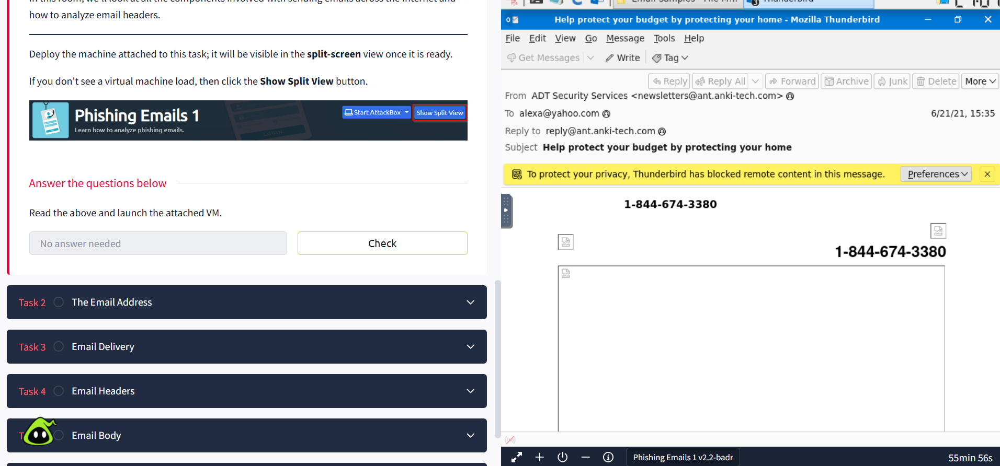
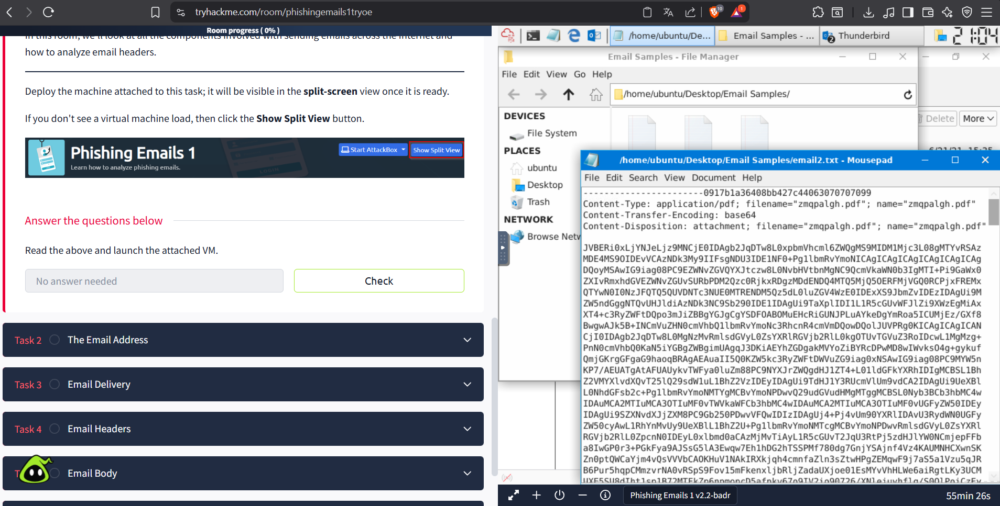
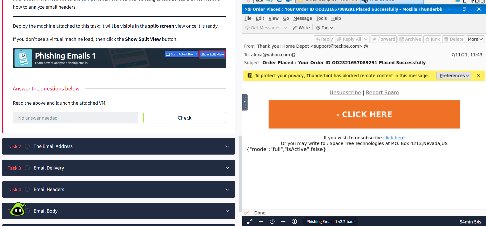

# 🛡️ **Attack Chain Analysis – Phishing Scenario**

>  *This project analyzes a phishing-based attack using the **Cyber Kill Chain** model from a **SOC (Security Operations Center)** perspective.*

 The objective is to understand how an attack progresses through different stages and identify **potential detection points and indicators of compromise (IOCs)** throughout the attack lifecycle.

 *This section provides a **generic example** intended for educational analysis rather than representing a real-world incident.*

---

#  Generic Example

##  Scenario Overview

An attacker sends a phishing email impersonating a trusted service.  
The message encourages the victim to interact with malicious content such as a **link or attachment**.

###  Example Structure of a Phishing Message

Subject: Security Notification  
Sender: alerts@trusted-service-support.com  
Attachment: verification_document.b64  
Link: https://trusted-service-support.com/login

###  Attacker Goals

The goal of the attacker is to trick the victim into:

- Opening a malicious attachment  
- Visiting a fake authentication page  
- Providing login credentials  
- Executing hidden payloads  

---

#  Simulated Phishing Emails

Below are simulated phishing email examples used for **educational analysis**.

---

## 📩 Example 1 — Fake Security Alert

This email uses **urgency and authority impersonation** to pressure the user into opening a malicious attachment.

---

## 📩 Example 2 — Account Verification Request

This example attempts to convince the user to **verify their account through a malicious link** leading to a fake authentication page.

---

## 📩 Example 3 — Suspicious Attachment Notification

The attacker disguises a malicious file as a document that supposedly requires immediate attention.

---

# 📁 File Location (Project Structure)

8bash
Cyber-SocAnalysis/
│
└── Docs/
    │
    └── Generic_Examples/
        ├── email1.png
        ├── email2.png
        └── email3.png

### Mapping

8bash
Example 1 → Docs/Generic_Examples/email1.png  
Example 2 → Docs/Generic_Examples/email2.png  
Example 3 → Docs/Generic_Examples/email3.png  

---

# ⚠️ Common Threat Techniques

Phishing attacks commonly rely on several deception techniques combining **technical manipulation and social engineering**.

| Technique | Description |
|---|---|
Email impersonation | Emails pretending to be legitimate organizations |
Spoofed sender domains | Fake sender identity |
Fake authentication portals | Credential harvesting pages |
Encoded attachments | Hidden malicious payloads |
Tracking elements | Monitoring victim interaction |
Urgent language | Psychological pressure |

---

# 🧠 Attack Stages (Cyber Kill Chain Model)

---

## 🔎 Reconnaissance

Attackers collect publicly available information about the target organization.

### Information commonly gathered

- Employee email addresses  
- Organizational structure  
- External service providers  
- Department roles  

### Possible sources

- Social media platforms  
- Public company websites  
- Data breach repositories  
- Automated harvesting tools  

### SOC Perspective

Reconnaissance is difficult to detect but may involve:

- Large-scale email enumeration  
- Automated scraping behavior  
- Suspicious directory queries  

---

## ⚙️ Weaponization

The attacker prepares the malicious artifact used in the phishing campaign.

### Possible components

- Spoofed email template  
- Fake login page  
- Encoded malicious attachment  
- Tracking elements to monitor victim interaction  

Example placeholder payload structure:

encoded_payload_example_base64

### Security Monitoring Focus

- Attachment scanning  
- Sandbox analysis  
- File reputation checks  

---

## 📤 Delivery

The phishing artifact is delivered to the victim through email or other communication channels.

### Indicators of Compromise

- Recently registered domains  
- Sender/domain mismatch  
- Encoded attachments  
- Unusual sender infrastructure  

### SOC Monitoring Points

- Email gateway logs  
- Domain reputation checks  
- DNS monitoring  
- Attachment sandbox results  

---

## 💥 Exploitation

The exploitation phase begins when the victim interacts with the malicious content.

Possible victim actions include:

- Clicking a malicious link  
- Opening an attachment  
- Entering credentials into a fake login portal  
- Executing a disguised file  

Example placeholder command or script:

malicious_execution_placeholder

### Detection Opportunities

Security teams may detect:

- Abnormal login attempts  
- Authentication from unfamiliar IP addresses  
- Access outside normal behavior patterns  
- Suspicious browser redirections  

---

## 💻 Installation

If the attack involves malware, the attacker attempts to establish persistence within the system.

Possible attacker activities:

- Installing malware  
- Creating scheduled tasks  
- Modifying startup behavior  
- Establishing command-and-control communication  

Example placeholder persistence mechanism:

persistence_script_placeholder

### Defensive Monitoring

SOC teams typically monitor for:

- Unexpected processes  
- System configuration changes  
- Suspicious outbound connections  
- Endpoint detection alerts  

---

# 🚨 Indicators of Compromise (IOCs)

During investigation analysts may observe indicators such as:

| Indicator Type | Example |
|---|---|
Suspicious domain | trusted-service-support.com |
Encoded attachment | verification_document.b64 |
User behavior anomaly | login from unusual location |
Email anomaly | sender/domain mismatch |

These indicators allow analysts to **correlate events across multiple security systems**.

---

# 🛡 SOC Detection Strategy

SOC analysts attempt to detect the attack at multiple stages.

| Stage | Possible Detection Method |
|---|---|
Reconnaissance | Monitoring enumeration behavior |
Weaponization | Attachment sandbox analysis |
Delivery | Email gateway alerts |
Exploitation | Abnormal authentication detection |
Installation | Endpoint detection alerts |

Detection becomes more reliable when **multiple signals are correlated across systems**.

---

# 🔐 Mitigation Strategies

Organizations can reduce phishing risk through multiple defensive measures.

- Email filtering and anti-phishing gateways  
- Domain reputation monitoring  
- Multi-factor authentication (MFA)  
- Security awareness training  
- Attachment sandboxing  
- Endpoint detection and response tools  

Human awareness remains critical because phishing attacks frequently rely on **user interaction**.

---

# 📌 Conclusion

This generic analysis demonstrates how a phishing attack progresses through the **Cyber Kill Chain**.

By identifying detection opportunities at each stage, SOC teams can improve their ability to:

- detect phishing attempts  
- investigate suspicious activity  
- respond before the attack escalates into full system compromise
